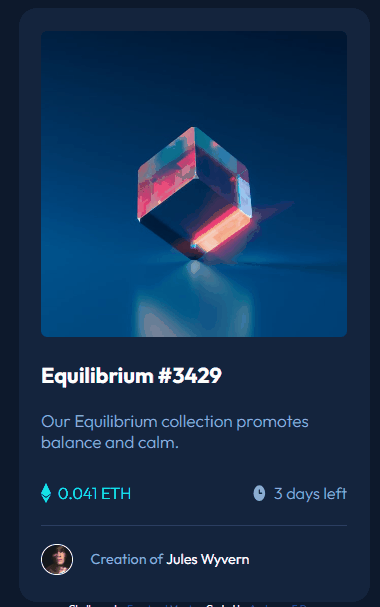

# Frontend Mentor - NFT preview card component solution

Esta é uma solução para o [Desafio da página componente de cartão de visualização NFT no Frontend Mentor](https://www.frontendmentor.io/challenges/recipe-page-KiTsR8QQKm). Os desafios do Frontend Mentor ajudam você a melhorar suas habilidades de codificação construindo projetos realistas.


### Screenshot

[]


### Link


- URL do site ativo: [link aqui](https://andersonf-dev.github.io/nft-preview-card-component/)


### Criado com

- Marcação HTML5 semântica
- Propriedades personalizadas CSS


### O que aprendi

Aprendi a criar uma página, posicionar elementos na tela centralizar e o sar o ::before e ::after


```css
.nft-card .image-link::before {
    display: none;
    content: '';
    background-color: hsl(178, 100%, 50%);
    border-radius: 7px;
    width: 100%;
    height: 100%;
    position: absolute;
    opacity: 0.4;
}

.nft-card .image-link::after {
    display: none;
    content: '';
    background: url('../images/icon-view.svg') center center no-repeat;
    position: absolute;
    width: 100%;
    height: 100%;
}

.nft-card .image-link:hover::before,
.nft-card .image-link:hover::after {
    display: block;
}
```

### Desenvolvimento contínuo

Este é apenas o setemo de muitos dos projetos de front end que fiz. Continuarei fazendo e me desenvolvendo ainda mais. Estou aprendendo cada dia mais, fazendo esses desafios, 
